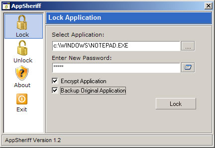



## AppSheriff aka Lock Exe

### Description

hi this is a new update of my LockExe program now called AppSheriff, anyway loads of code fixes, Replaces the FileOps with byte arrays, added some encryption and backup options and some new password options, also fixed the GUI and added a help system, anyway hope you like the new version.
 
### More Info
 

             |
---                |---
**Submitted On**   |2008-01-16 16:13:20
**By**             |[dreamvb](https://github.com/Planet-Source-Code/PSCIndex/blob/master/ByAuthor/dreamvb.md)
**Level**          |Intermediate
**User Rating**    |5.0 (20 globes from 4 users)
**Compatibility**  |VB 6\.0
**Category**       |[Complete Applications](https://github.com/Planet-Source-Code/PSCIndex/blob/master/ByCategory/complete-applications__1-27.md)
**World**          |[Visual Basic](https://github.com/Planet-Source-Code/PSCIndex/blob/master/ByWorld/visual-basic.md)
**Archive File**   |[AppSheriff2097751162008\.zip](https://github.com/Planet-Source-Code/dreamvb-appsheriff-aka-lock-exe__1-69797/archive/master.zip)

